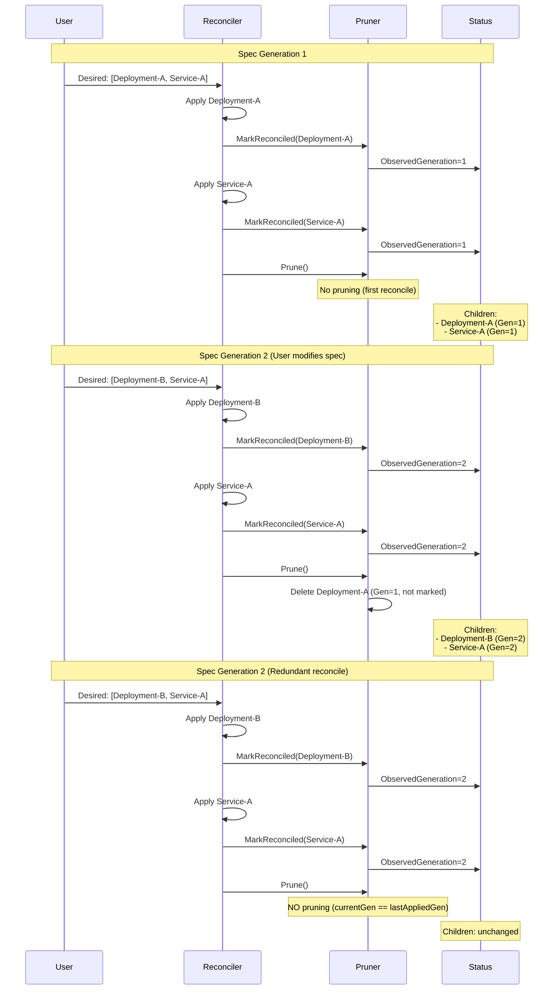

# reconcileprune

A Go library for generation-aware reconciliation and pruning of Kubernetes resources in controller-runtime based operators.

## Overview

`reconcileprune` simplifies the management of child resources in Kubernetes operators by:
- Tracking which child resources are desired in the current reconciliation
- Pruning stale resources from previous generations
- Maintaining a complete inventory of managed children with generation tracking

You remain in control of how resources are applied (SSA, Create/Update, or any other method).

## Key Features

- **Generation-aware pruning**: Only deletes resources from previous generations, preventing accidental deletion during redundant reconciliations
- **Bring your own apply**: You control how resources are applied (SSA, Create/Update, etc.)
- **Flexible configuration**: DryRun mode and custom error handlers
- **Status tracking**: Maintains list of all managed children with generation metadata
- **Fake client compatible**: Works seamlessly with controller-runtime's fake client for testing

## Installation

```bash
go get github.com/guilhem/reconcileprune
```

## Quick Start

### 1. Add Status Fields to Your CRD

```go
type MyCustomResourceStatus struct {
    // Children tracks all managed child resources
    Children []reconcileprune.ManagedChild `json:"children,omitempty"`
}
```

This generates the following structure in your CRD:

```yaml
status:
  children:
  - objectReference:
      apiVersion: apps/v1
      kind: Deployment
      namespace: default
      name: my-app
      uid: abc-123
    observedGeneration: 2
```

### 2. Setup Your Reconciler

```go
import (
    "context"
    
    "github.com/guilhem/reconcileprune"
    ctrl "sigs.k8s.io/controller-runtime"
    "sigs.k8s.io/controller-runtime/pkg/client"
)

type MyReconciler struct {
    client.Client
    Scheme *runtime.Scheme
}

func (r *MyReconciler) SetupWithManager(mgr ctrl.Manager) error {
    return ctrl.NewControllerManagedBy(mgr).
        For(&myv1.MyCustomResource{}).
        Complete(r)
}
```

### 3. Use in Your Reconcile Function

```go
func (r *MyReconciler) Reconcile(ctx context.Context, req ctrl.Request) (ctrl.Result, error) {
    // Fetch the custom resource
    var myCR myv1.MyCustomResource
    if err := r.Get(ctx, req.NamespacedName, &myCR); err != nil {
        return ctrl.Result{}, client.IgnoreNotFound(err)
    }
    
    // Create pruner for this reconciliation
    pruner := reconcileprune.NewPruner(r.Client, &myCR, &myCR.Status.Children,
        reconcileprune.WithScheme(r.Scheme),
    )
    
    // Apply each desired resource (using your preferred method)
    deployment := r.buildDeployment(&myCR)
    if err := r.applyResource(ctx, deployment); err != nil {
        return ctrl.Result{}, err
    }
    if err := pruner.MarkReconciled(deployment); err != nil {
        return ctrl.Result{}, err
    }
    
    service := r.buildService(&myCR)
    if err := r.applyResource(ctx, service); err != nil {
        return ctrl.Result{}, err
    }
    if err := pruner.MarkReconciled(service); err != nil {
        return ctrl.Result{}, err
    }
    
    // Prune stale resources
    pruned, err := pruner.Prune(ctx)
    if err != nil {
        return ctrl.Result{}, err
    }
    
    // Update status to persist changes
    if err := r.Status().Update(ctx, &myCR); err != nil {
        return ctrl.Result{}, err
    }
    
    log.Info("Reconciliation complete",
        "pruned", len(pruned))
    
    return ctrl.Result{}, nil
}
```

## How It Works

### Generation-Based Pruning Flow



### Key Rules

1. **User controls apply**: You apply resources using your preferred method (SSA, Create/Update, etc.)
2. **Mark what's desired**: Call `MarkReconciled()` for each resource you want to keep
3. **Prune only on generation change**: `currentGen > lastAppliedGen` from previous reconcile
4. **Prune targets**: Resources with `ObservedGeneration < currentGen` that were NOT marked as reconciled

## Configuration Options

### DryRun Mode

Preview what would be pruned without actually deleting resources.
Uses Kubernetes dry-run to validate deletions:

```go
pruner := reconcileprune.NewPruner(client, &myCR, &myCR.Status.Children,
    reconcileprune.WithScheme(scheme),
    reconcileprune.WithDryRun(true),
)

// Apply and mark your desired resources
for _, obj := range desired {
    _ = applyResource(ctx, obj)
    _ = pruner.MarkReconciled(obj)
}

pruned, err := pruner.Prune(ctx)
if err != nil {
    return ctrl.Result{}, err
}

// Update status
_ = client.Status().Update(ctx, &myCR)

// pruned contains ObjectReferences that would be deleted
// Resources are validated but not actually removed
```

### Custom Error Handler

Override default error handling during pruning:

```go
errorHandler := func(ctx context.Context, err error, obj client.Object) error {
    log.Error(err, "Failed to delete resource",
        "name", obj.GetName(),
        "namespace", obj.GetNamespace())
    
    // Return nil to ignore error and continue
    // Return err to fail the reconciliation
    return nil
}

pruner := reconcileprune.NewPruner(client, &myCR, &myCR.Status.Children,
    reconcileprune.WithScheme(scheme),
    reconcileprune.WithErrorHandler(errorHandler),
)
```

## API Reference

### Pruner

```go
type Pruner struct {
    // Internal fields
}

func NewPruner(
    client client.Client,
    owner client.Object,
    children *[]ManagedChild,
    opts ...Option,
) *Pruner

// Mark a resource as reconciled (desired) for this session
func (p *Pruner) MarkReconciled(obj client.Object) error

// Prune stale resources from previous generations
// Returns list of pruned resources as ObjectReferences
func (p *Pruner) Prune(ctx context.Context) ([]corev1.ObjectReference, error)
```

### ManagedChild

```go
type ManagedChild struct {
    // ObjectReference identifies the child resource
    ObjectReference corev1.ObjectReference `json:"objectReference"`
    // ObservedGeneration is the parent's generation when this child was last applied
    ObservedGeneration int64 `json:"observedGeneration"`
}
```

## Testing

The library is designed to work seamlessly with controller-runtime's fake client:

```go
func TestMyReconciler(t *testing.T) {
    scheme := runtime.NewScheme()
    _ = myv1.AddToScheme(scheme)
    _ = appsv1.AddToScheme(scheme)
    
    client := fake.NewClientBuilder().
        WithScheme(scheme).
        WithStatusSubresource(&myv1.MyCustomResource{}).
        Build()
    
    owner := &myv1.MyCustomResource{...}
    _ = client.Create(context.Background(), owner)
    
    pruner := reconcileprune.NewPruner(client, owner, &owner.Status.Children,
        reconcileprune.WithScheme(scheme),
    )
    
    // Apply your resources
    deployment := buildDeployment()
    _ = client.Create(context.Background(), deployment)
    
    // Mark as reconciled
    _ = pruner.MarkReconciled(deployment)
    
    // Test pruning behavior
    pruned, err := pruner.Prune(context.Background())
    if err != nil {
        t.Fatal(err)
    }
    
    // Update status
    _ = client.Status().Update(context.Background(), owner)
    
    // Check pruned resources
    if len(pruned) != 0 {
        t.Errorf("Expected no pruned resources, got %d", len(pruned))
    }
}
```

## Example: Before and After

### Before Reconcile (Generation 1)

```yaml
apiVersion: example.com/v1
kind: MyCustomResource
metadata:
  name: my-app
  namespace: default
  generation: 1
spec:
  replicas: 3
  services:
    - web
    - api
status:
  children: []
```

### After Reconcile (Generation 1)

```yaml
apiVersion: example.com/v1
kind: MyCustomResource
metadata:
  name: my-app
  namespace: default
  generation: 1
spec:
  replicas: 3
  services:
    - web
    - api
status:
  children:
  - objectReference:
      apiVersion: apps/v1
      kind: Deployment
      namespace: default
      name: my-app-web
    observedGeneration: 1
  - objectReference:
      apiVersion: v1
      kind: Service
      namespace: default
      name: my-app-web
    observedGeneration: 1
  - objectReference:
      apiVersion: apps/v1
      kind: Deployment
      namespace: default
      name: my-app-api
    observedGeneration: 1
  - objectReference:
      apiVersion: v1
      kind: Service
      namespace: default
      name: my-app-api
    observedGeneration: 1
```

### After Spec Change (Generation 2)

User removes "api" service from spec:

```yaml
apiVersion: example.com/v1
kind: MyCustomResource
metadata:
  name: my-app
  namespace: default
  generation: 2  # Incremented by API server
spec:
  replicas: 3
  services:
    - web  # api removed
status:
  children:
  - objectReference:
      apiVersion: apps/v1
      kind: Deployment
      namespace: default
      name: my-app-web
    observedGeneration: 2
  - objectReference:
      apiVersion: v1
      kind: Service
      namespace: default
      name: my-app-web
    observedGeneration: 2
  # api resources pruned (were ObservedGeneration=1, not marked as reconciled)
```

## License

Apache License 2.0 - See [LICENSE](LICENSE) for details.

## Contributing

Contributions are welcome! This library follows Kubernetes community standards.

## Credits

Built with [controller-runtime](https://github.com/kubernetes-sigs/controller-runtime) for the Kubernetes operator community.
